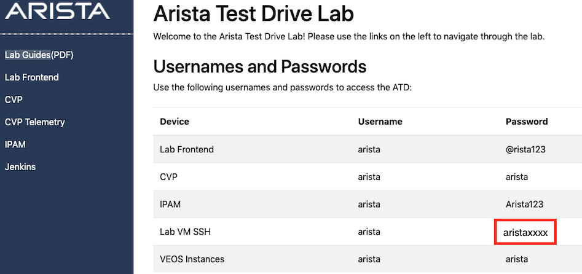
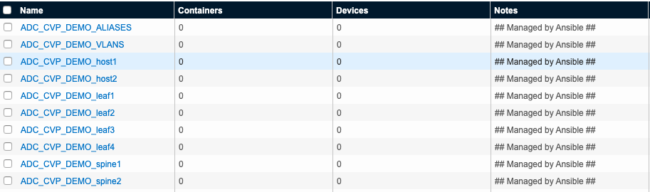

# Automation Examples for Arista Demo Cloud (ADC)

As part of the ADC, the flexibility of managing an Arista Network with CloudVision and Common DevOps Toolsets (Ansible & Python) is demonstrated with example Ansible Playbooks and Python scripts.

Prior to running these playbooks, Ansible must be upgraded to latest version to support Ansible Collections. Sudo password for user 'arista' can be found on Arista Test Drive Lab page.



To upgrade Ansible run the following PIP command:
```
sudo pip install ansible --upgrade
[sudo] password for arista: xxxxxxxx
```
Once Ansible has been upgraded you can proceed to running the playbooks below.

### 1. Create configlets for Spine and Leafs in ther Topology from CSV (./datafiles/switch_info.csv)

```
ansible-playbook create-configlets-from-csv.yml
```

### 2. Backup running-config on each device to ./config_backup

```
ansible-playbook backup-configs.yml
```

### 3. Upload configlets to CVP from directory ./configlets

This step MUST be completed before moving to Step 4, as the configlets need to be in CVP before running the playbook in Step 4.

```
ansible-playbook configlet-uploader.yml
```
or you can run a Python script to do the same work
```
./pushconfigs_to_cvp.py
```

### 4. Bind Configlets to single device 'leaf1'
Makes use of Tags to provision or rollback changes to the device.  Static list of configlets are defined in the playbook.  After each playbook is run you must go into CVP and execute the Task created for 'leaf1'.

WARNING: Make sure configlets have been uploaded to CVP before proceeding.




#### Run 1st to provision
```
ansible-playbook device-configlets.yml --tags provision
```
#### Run 2nd to rollback
```
ansible-playbook device-configlets.yml --tags rollback
```
### 5. Gather info from 'spine1' with Python script

```
./spine1-info.py
```
### 6. Gather info from all spines and leafs with Python script

```
./net-info.py
```